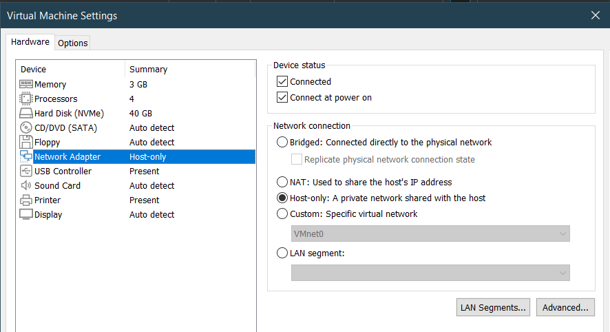
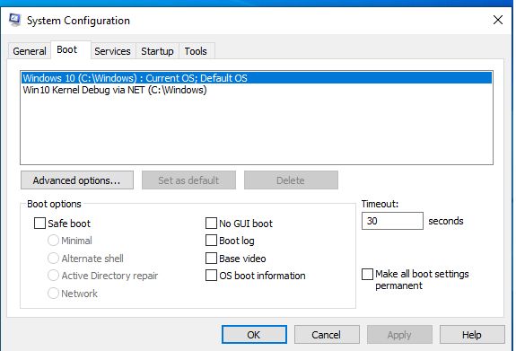
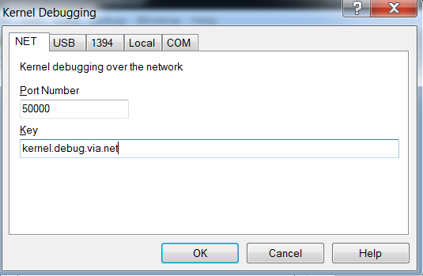
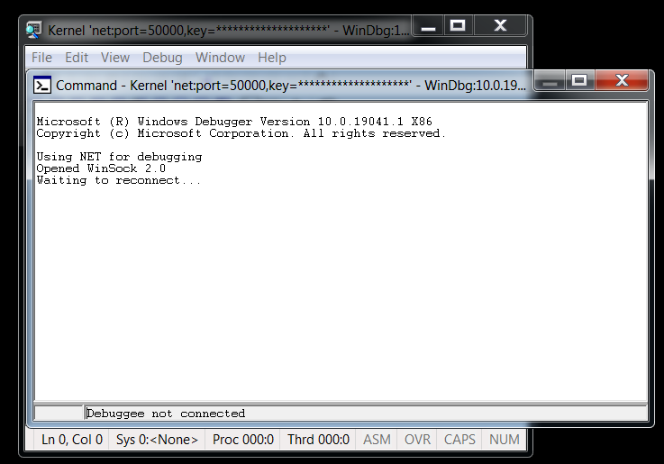
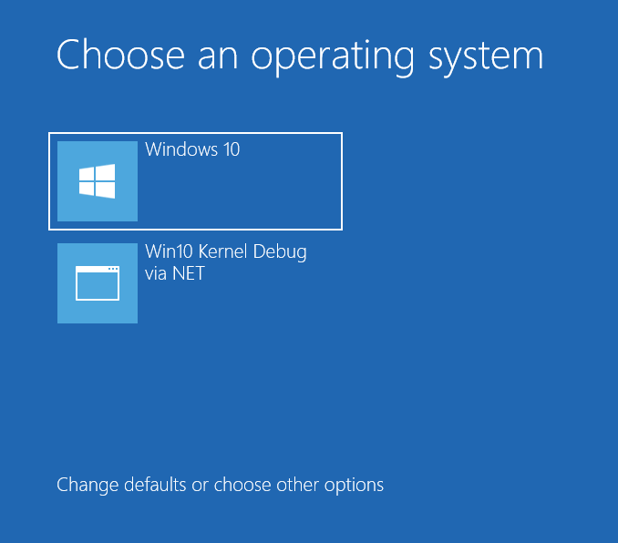

# WINDBG: Windows Kernel Debugging Using Windows VM as Debugger

A little note so that I won't forget how to attach a Windows VM's WinDBG to other Win VM so that i could use a virtual Windows to debug kernels of other virtual Win.  
  
  You will need 2 virtual machines:
- Debugger (which runs windbg): Windows 7 or later (mine is 7 x64) virtual machine have windbg installed
- Debuggee (which being debugged): Windows 8 or later (mine is 10 x64) virtual machine  

Both VMs' network adapter is set to Host-Only:
On VMWare Workstation, open `VM` -> `HardWare` tab -> `Network Adapter` option -> NAT  

  
  
Get the debugger's IP: open `cmd` on the debugger and type `ipconfig`, get the `IPv4 Address` value. Mine is `192.168.247.128`.  
  
From what I know, we can use different methods to setup: Through Serial Port or using network based (only available with win 8 or later). Using serial port is drastic slow so, if possible, please use network. I'm writing about the network method.  

## The debuggee
1. Open `cmd.exe` as an Adminstrator. First we need to create a debugging option when we power on the system so that we can debug it. In the `cmd` type:
```
bcdedit /copy {current} /d <Your boot loader name of desire>
```
For example, mine is:
```
bcdedit /copy {current} /d "Win10 Kernel Debug via NET"
```
It will output a 32 char identifier, remember it. Mine is `The entry was successfully copied to {96a58713-5943-11ec-9dfc-b46d074067e9}.`  
Config some options to get the work done:
```
bcdedit /debug {96a58713-5943-11ec-9dfc-b46d074067e9} on
bcdedit /set {96a58713-5943-11ec-9dfc-b46d074067e9} debug on
bcdedit /set {96a58713-5943-11ec-9dfc-b46d074067e9} debugtype net
bcdedit /set {96a58713-5943-11ec-9dfc-b46d074067e9} port 50000
bcdedit /set {96a58713-5943-11ec-9dfc-b46d074067e9} hostip 192.168.247.128 nodhcp (Remember to replace the ip here to yours!)
bcdedit /set {96a58713-5943-11ec-9dfc-b46d074067e9} key kernel.debug.via.net (you can choose the key of desire!)
```
  
Type in `bcdedit` to see if our VM's Boot Manager have our newly created entry (and most important, the option `debug` has status `Yes`). Usually, it appears at the last of the ouput.  
```
Windows Boot Loader
-------------------
identifier              {96a58713-5943-11ec-9dfc-b46d074067e9}
device                  partition=C:
path                    \Windows\system32\winload.exe
description             Win10 Kernel Debug via NET
locale                  en-US
key                     kernel.debug.via.net
inherit                 {bootloadersettings}
recoverysequence        {96a58711-5943-11ec-9dfc-b46d074067e9}
debugtype               NET
hostip                  192.168.247.128
port                    50000
displaymessageoverride  Recovery
recoveryenabled         Yes
allowedinmemorysettings 0x15000075
osdevice                partition=C:
systemroot              \Windows
resumeobject            {96a5870f-5943-11ec-9dfc-b46d074067e9}
nx                      OptIn
bootmenupolicy          Standard
debug                   Yes
```  

You can check it by press `Win + R` and type in `msconfig`. Open `Boot` tab and make sure our new entry appears in here. You don't need to set it to default, though.  
  
  
  

After that, go to your debugger.  
# The Debugger
Open WinDBG, go to `File`-> `Kernel Debug` (or press `Ctrl + K`). Go to `NET` tab and make sure all the information is matched like this:  
  
  
  
A window may pop up to ask for allowance through firewall, remember to check the box of `Private network`.  
If nothing goes wrong, you should see the Command Window of the WinDBG similar to this:  

  
  
After this, go back to the debugee and restart it. On startup, windows will let you choose which boot to be loaded.  
  
  
  
Choose our newly created option. If no mistake was made, you should see the Command Window of WinDBG look something like mine:  
```
Connected to target 192.168.247.130 on port 50000 on local IP 192.168.247.128.
You can get the target MAC address by running .kdtargetmac command.
Connected to Windows 10 19041 x64 target at (Thu Dec  9 22:30:54.719 2021 (UTC + 7:00)), ptr64 TRUE
Kernel Debugger connection established.

************* Path validation summary **************
Response                         Time (ms)     Location
Deferred                                       symsrv*symsrv.dll*C:\symbols*http://msdl.microsoft.com/download/symbols
Symbol search path is: symsrv*symsrv.dll*C:\symbols*http://msdl.microsoft.com/download/symbols
Executable search path is: 
Windows 10 Kernel Version 19041 MP (1 procs) Free x64
Built by: 19041.1.amd64fre.vb_release.191206-1406
Machine Name:
Kernel base = 0xfffff801`32600000 PsLoadedModuleList = 0xfffff801`3322a3d0
System Uptime: 0 days 0:00:01.038
KDTARGET: Refreshing KD connection
```
  
Hope it helps!

